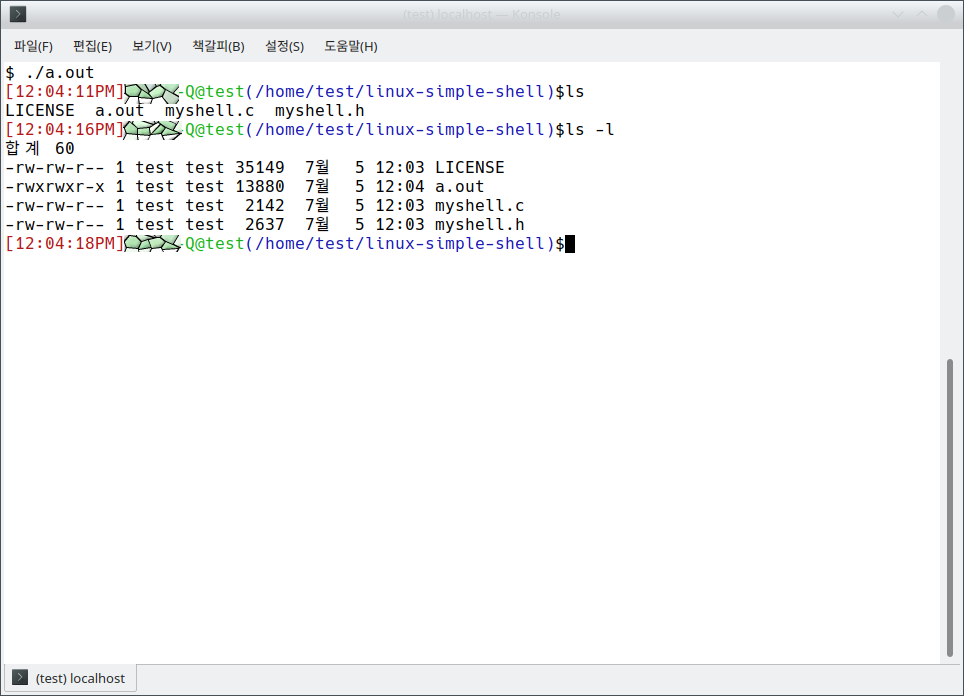

# Linux Simple Shell

This is the simple linux shell. Before you run this program you have to compile this file to use below command.

```c
gcc *.c
```

After, the compiler executes. You can get the program which is named `a.out`.

With your program. You type the command `./a.out` in your location. Then it will bring you the screen like below.



You can exit this program with Ctrl+D.

NOTICE! This program doesn't support any kinds of `exit` and `|(pipe)` commands.